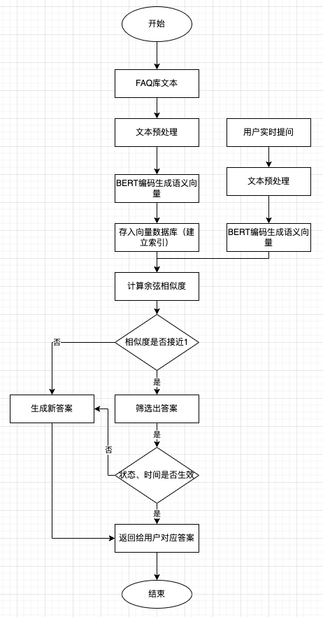

* 目标：
  -
  代替人工客服，用户的提问直接与历史的提问进行匹配，将最相似的提问的回答返回给用户。

* 整体流程图

* 详细技术方案
  -
  以BERT预训练模型为核心，完成FAQ文本与用户提问的语义编码，通过余弦相似度计算实现精准回答匹配，全程依托BERT的深度双向语义表征能力，规避传统词匹配的语义缺失问题。具体步骤如下：
  - 文本预处理：对FAQ库中的标准问法、相似问法及用户实时提问做统一处理。
    - 清洗特殊字符
    - 统一编码格式
    - 分词处理
    - 去除停用词
    - 文本标准化，按照BERT输入要求，添加[CLS]起始符、[sep]分隔符,做固定长度的截断/补零处理。
  - BERT文本编码：将预处理后的文本输入BERT-base预训练模型，提取[CLS]位置的输出向量作为整句的语义表征向量（维度678）。
  - 向量化存储
    - 将语义向量存入向量数据库。
    - 建立"问题-语义-向量-FAQ答案"的关联索引。
  - 实时编码与相似度计算
    - 接收用户提问后，执行相同的预处理与BERT编码流程，得到用户提问的语义向量；
    - 计算该向量与向量数据库中所有FAQ问题向量的余弦相似度，取值范围[-1,1],值越接近1表示语义相似度越高。
  - 结果匹配与返回：筛选出相似度最高的FAQ问题，校验其生效状态与生效时间，确认有效后返回对应的答案，完成智能问答匹配。
  